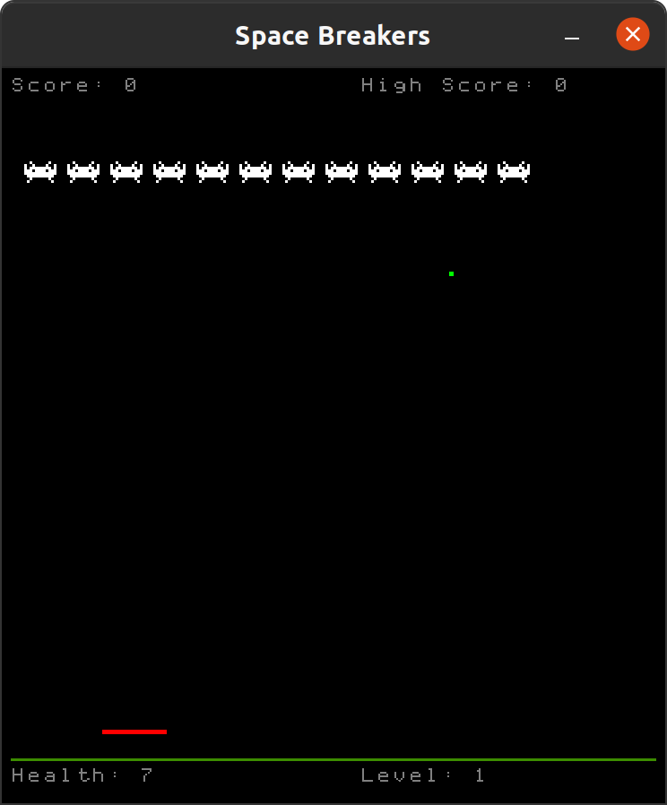

# SDL2 Space-Breakers

This is a small Space-Invaders-meets-Brick Break game I created for fun.
It's written in C++11 using SDL2 for rendering and graphics.  The object of the
game is simple; survive while destroying the invaders. The invaders will shoot
projectiles, and it is your job to attempt to deflect them by bouncing them off
the paddle and back at them. You gain points for properly deflecting attacks and
destroying invaders.

You begin with 10 health, and slowly lose it each time you miss a projectile.
At the end of each level, you earn back 2 times the level difficulty life back
in preparation for the next level (i.e. if you pass level 1 you get 2 health,
if you pass level 2 you get 4 health, etc).
Points are also multiplied by the level.



## Controls

* <kbd>Left</kbd> or <kbd>A</kbd>: Move paddle left
* <kbd>Right</kbd> or <kbd>D</kbd>: Move paddle left
* <kbd>ESC</kbd>: Pause / Unpause
* <kbd>Shift</kbd>: Move faster

## Compilation

### Dependencies

This project requires [SDL2](https://www.libsdl.org/) to compile along with the
additional components `SDL2_ttf`, `SDL2_mixer`, and `SDL2main`.

#### Ubuntu

On Ubuntu, this can be installed with

```bash
sudo apt install -y libsdl2-dev libsdl2-mixer-dev libsdl2-ttf-dev
```

### Building

The project can be built with CMake by generating a project followed by building
it:

```bash
mkdir build
cd build
cmake .. -DCMAKE_BUILD_TYPE=Release -DCMAKE_INSTALL_PREFIX="<where to install>"
cmake --build .
```